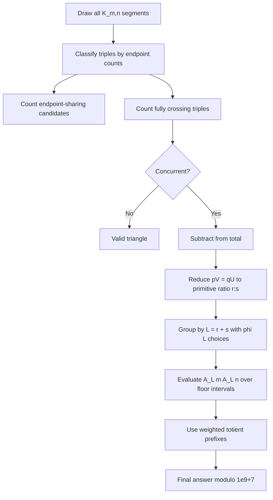

# Project Euler 994: Triangle Count

## Problem
For all segments from $(i,1)$ to $(j,2)$, with $1 \le i \le m$ and $1 \le j \le n$, compute the number of triangles in the drawing.

The target is:

$$
T(1234 \times 10^8, 2345 \times 10^8) \pmod {10^9+7}.
$$

## Key Idea
A triangle is determined by three distinct drawn segments whose pairwise intersections all exist and produce three distinct points.

Classifying triples by lower and upper endpoint counts gives the candidate count:

$$
2\binom m2\binom n2
+2\binom m2\binom n3
+2\binom m3\binom n2
+\binom m3\binom n3.
$$

The fully crossing triples in $\binom m3\binom n3$ must be corrected when all three segments are concurrent.

For lower adjacent gaps $p,q$ and upper adjacent gaps $U,V$, concurrence is:

$$
pV=qU.
$$

Writing $p=gr$, $q=gs$, $U=rh$, $V=sh$, with $\gcd(r,s)=1$ and $L=r+s$, gives the correction:

$$
\sum_{L=2}^{\min(m-1,n-1)} \varphi(L)A_L(m)A_L(n),
$$

where:

$$
A_L(N)=\sum_{k=1}^{\lfloor (N-1)/L \rfloor}(N-kL).
$$

## Algorithm
The solver groups intervals where both $\lfloor(m-1)/L\rfloor$ and $\lfloor(n-1)/L\rfloor$ are constant. Over each interval, $A_L(m)A_L(n)$ is a quadratic polynomial in $L$.

Those interval sums are evaluated using weighted totient prefixes:

$$
F_k(x)=\sum_{i\le x}i^k\varphi(i),\quad k=0,1,2.
$$

The prefix values are computed with a linear sieve below `SIEVE_LIMIT` and memoized Du Jiao-style recursion above it.

## Verification
The solver checks:

```text
T(2, 3) = 8
T(3, 5) = 146
T(12, 23) = 756716
```

## Usage
```sh
g++ -O2 -std=c++17 "994/GPT-5.5/solve.cpp" -o solve
./solve
```

Final answer:

```text
350247268
```

## Diagram

